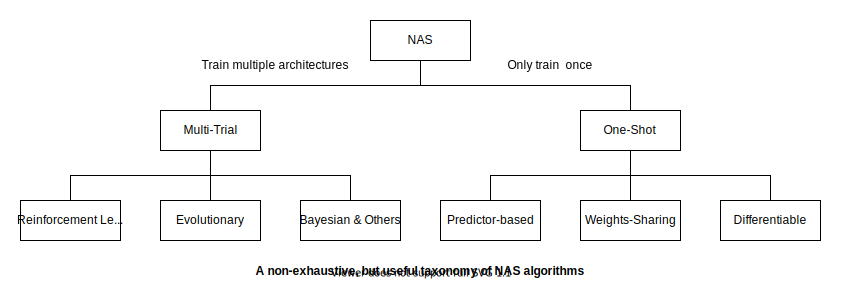
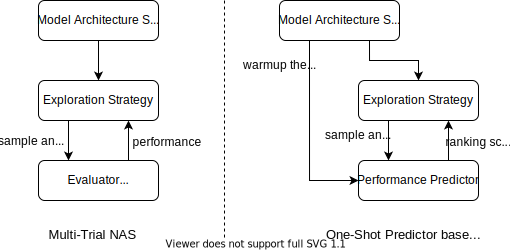

# Introduction to NAS

## What This Is
Welcome to the Spinning Up documentation in Neural Architecture Search (NAS) from the [NNI](https://github.com/microsoft/nni) team. During building the AutoML tool, we find that some users, especially the beginners, need to a simple but clear introduction to this area. Inspired by the [OpenAI Spinning Up in deep RL](https://spinningup.openai.com/en/latest/), we build up this educational resource to help users better understand how NAS works and enhance their ability to land NAS into practice. This is kind of a survey work, but more focused on concepts other than details of algorithms.

## The Motivation and Challenges
*Placeholder for the advantage and motivation of adopting NAS in practical scenarios.*

## Key Concepts and Terminology

The objective of NAS is to find an network architecture $a$ from a predefined model search space $\mathcal{A}$ that maximizes the predictive performance on unseen data $\phi(a)$

$$a^\star = \mathop{\arg\max}_{a\sim \mathcal{A}} \, \,  \phi(a)$$

For a network architecture $a$ and its weights $w$, let's denote its training loss by $\mathcal{L}_{train}(a,w)$ and its predictive performance (e.g., classification accuracy) on validation dataset by $\mathcal{P}_{val}(a,w)$. Then $\phi(a)$ is usually defined by

$$\phi(a) = \mathcal{P}_{val} (a, W_a^\star)$$

where $W_a^\star$ is the weights learned to minimize the training loss

$$W_a^\star = \mathop{\arg\min}_W \, \, \mathcal{L}_{train}(a, W)$$

Above formulation illustrates three key elements in a NAS approach, which are the ***Model Search Space*** ($\mathcal{A}$), the ***Model Evaluator*** ($\phi(a)$) and the ***Exploration Strategy*** ($\arg\max_{a\sim \mathcal{A}}{\phi(a)}$). 

*Note: In the [well written survey](https://arxiv.org/abs/1808.05377), the three elements are called search space, performance estimation strategy and search strategy.*

### Model Search Space
Model search space, aka. model space or architecture space, defines the set of all the possible network architectures that a NAS approach could discover. 

!!! info "Architecture Sampling"
    The process of selecting a specific architecture $a$ from the model search space is called *architecture sampling* and denoted by $a \sim \mathcal{A}$.

!!! tip "You should know"
    According to the empirical results, the design of model search space, which represents the human knowledge about the tasks, has big influence on the end-to-end result of NAS. Thus the NAS designers may specialize the model search space for the given task or deployment platform. 

### Exploration Strategy
Exploration strategy, aka. search strategy, is the optimization algorithm used to explore the huge model search space and maximize the evaluation function. Since optimization problem is an old question studied for decades, there are lots of algorithms being tested in searching the best candidate, such as 

- Parameter free approaches, like [grid search](https://en.wikipedia.org/wiki/Hyperparameter_optimization#Grid_search) and [random search](https://en.wikipedia.org/wiki/Hyperparameter_optimization#Random_search)
- [Bayesian optimization](https://en.wikipedia.org/wiki/Bayesian_optimization) approaches, like [Tree Parzen Estimator (TPE)](http://papers.neurips.cc/paper/4443-algorithms-for-hyper-parameter-optimization.pdf) and [SMAC](http://www.cs.ubc.ca/labs/beta/Projects/SMAC/)
- Stochastic optimization approaches, like [evolutionary algorithm](https://en.wikipedia.org/wiki/Evolutionary_algorithm)
- Reinforcement learning, like [Proximal Policy Optimization (PPO) algorithms](https://arxiv.org/abs/1707.06347)
- Gradient based methods

*Note: The approaches before gradient-based methods are sometimes called gradient-free methods.*

### Model Evaluator
Model evaluator, aka. performance estimation strategy, is the function to score the quality of an arbitrary model architecture. The scores are used to guide the exploration strategy to find the best architecture.

The ideal evaluation function is directly using $\phi(a)$ defined as above, which requires a standard training from sketch and evaluation of the whole training and validation dataset respectively. However, due to the unfortunately huge computational cost, it is not suitable in the scenario of NAS, where tens of thousands of architectures needs to be evaluated. 

Knowing the real accuracy of a given architecture is a too strict and hard prerequisite to meet. In many cases, a rough approximate or even just a rough comparison between two architectures is sufficient to guide the search strategies. 
To reduce the evaluation cost, some low cost approximates (denoted by $\hat{\phi}(a)$) are widely used to replace the origin $\phi(a)$ in NAS algorithms. The commonly used approximations include 

- insufficient training results, 
- performance with shared weights on supernet, 
- a specialized ranking network (ranker) to compare the capacity of architectures. 

!!! info "Ranking Quality"
    It's natural to raise the question of how to measure the quality of $\hat{\phi}(a)$. [Kendall's $\tau$ coefficient](https://en.wikipedia.org/wiki/Kendall_rank_correlation_coefficient), a measurement of rank correlation, is widely used to prove the effectiveness of $\hat{\phi}(a)$ in many recent literatures. 

    However, the nature of NAS is to identify the ***top ranked*** samples from the space. Though frequently used, Kendall's $\tau$ coefficient cares the ranking quality among the whole space, not only the top part. This implies that algorithms taking it as optimization object may waste some capacity on the unimportant part of space. 

### Extended Reading

- [Neural architecture search: A survey](https://www.jmlr.org/papers/volume20/18-598/18-598.pdf)
- [A survey on neural architecture search](https://arxiv.org/abs/1905.01392)
- [Weight-Sharing Neural Architecture Search: A Battle to Shrink the Optimization Gap](https://arxiv.org/abs/2008.01475)

## Kinds of NAS algorithms

NAS is rapid-growing research area. There are importing works rising every year and it leads to great difficulties for beginners to get a big picture of these algorithms. Though well realizing the impossibility, we draw a taxonomy modified from the origin of [this survey](https://arxiv.org/abs/2008.01475).

{: .center}

We hope the readers realize that this taxonomy is not so accurate and comprehensive. The purpose of it is to help to give a brief picture and the evolving of algorithms.

### Multi-Trial NAS 

Early NAS algorithms work in a multi-trial way, where the sampled candidate architecture is trained independently and individually. 

{: .center}

The *left* of above diagram is the classic abstract illustration of multi-trial NAS algorithms. In every iteration, controller (exploration strategy, especially gradient-free methods) samples a candidate architecture from the space, and passes it to the model evaluator. The evaluator trains and tests the performance the architecture and returns it back to controller. Then controller decides which architecture to be sampled in the next iteration according to the optimization algorithms.

Since the cost of the complete NAS process can be approximated as the product of number of architectures evaluated and the cost of each single evaluation (the computation of controller itself is typically ignorable), such works tries different algorithms (e.g., evolutionary or reinforcement learning) to improve the efficiency of exploring.

Another frequently adopted improvement is to speedup the evaluation based on insufficient training results (aka. *lower fidelity estimates*), such as 

- training on few epochs and sub-dataset
- prediction or early stop based on learning curves

#### Extended reading
- Reinforcement Learning
    - RL-NAS: [Neural Architecture Search with Reinforcement Learning](https://arxiv.org/abs/1611.01578)
    - NASNet: [Learning transferable architectures for scalable image recognition]()
    - PNAS: [Progressive neural architecture search]()
    - [Practical block-wise neural network architecture generation]()
    - [Mnasnet: Platform-aware neural architecture search for mobile]()
    - [Efficientnet: Rethinking model scaling for convolutional neural networks]()
    - [Nas-fpn: Learning scalable feature pyramid architecture for object detection]()
    - [Efficientdet: Scalable and efficient object detection]()
- Evolutionary
    - [Large-scale evolution of image classifiers]()

### One-shot Predictor-based NAS
Following the direction of speeding up the evaluation, some recent works build performance predictors to replace the costly training and testing operation (illustrated by the *right* of above diagram). 

#### Extending reading
- [BRPNAS]()

### One-Shot Weights Sharing
*placeholder for discussing different weights sharing methods, e.g., block-level, super-kernel.*

### Differential NAS

#### Extending reading
- [Darts: Differentiable architecture search]()